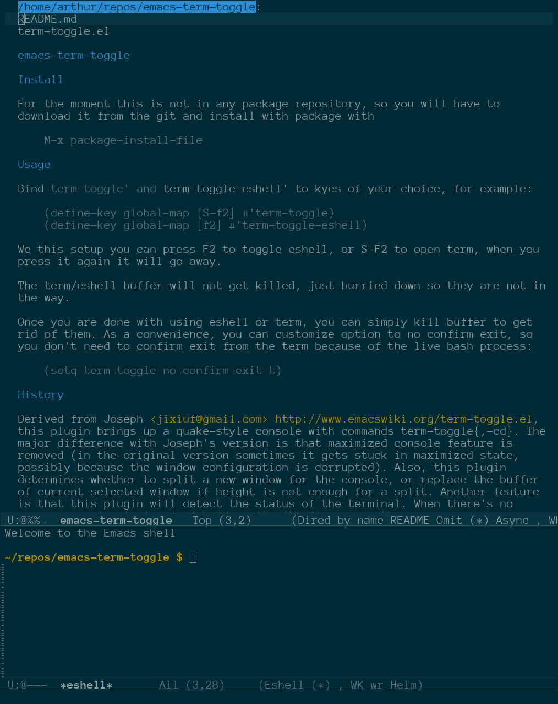

# emacs-term-toggle

## About



Term-toggle lets you quickly toggle shells that come built into Emacs. Currently it can toggle shell, term, ansi-term, eshell, ielm, and SLIME. You can put each one on a keyboard shortcut and toggle a console off and on as needed. The console opens in the current buffer's default directory. This application is similar to shell-pop, but this one lets you have different terminals open at once, while shell-pop works only on a pre-defined one. I like to work with ielm/eshell and also open a terminal from time to time, so I don't want to have just one pre-defined terminal I can pop back and forth. Term-toggle is also much lighter in resource usage, with somewhat fewer features, than shell-pop. Most notably you can't easily add your own shell via an API, but it is so small that you can easily hack it in. :)

It is all about convenience and minimalism. I personally care only about eshell, term, and ielm, and I want to toggle them on and off quickly. When I want to kill a terminal, I don't want to answer yes-or-no questions, so it has features to quickly kill a buffer or its process.

## Features

 - minimalistic and light on resources
 - multiple shells out of the box
 - automatically exit process when console buffer is killed
 - automatically kill buffer and its window when shell is exited
 - per directory toggle
 - cycle toggles
 - Helm integration
 - Quake-style slide-in/slide-out
 - split by side (above, below, left, right)

## Install

For the moment this is not in any package repository. You can download it from the git repo and install it with package.el:

M-x package-install-file RET

Alternatively, if you are using Emacs 29.0 and later, you can install via package-vc directly from the remote repo. See the Emacs manual for use-package and package-vc.

I will see if they would like to have it in MELPA.

Alternatively, you may install it manually by adding term-toggle.el to your load path and either generating autoloads, or requiring term-toggle.el when Emacs starts.

## Manual

A short tour of every feature, one paragraph at a time. Each entry says what to set or press to get the behaviour.

### Choosing which terminal to toggle

To toggle a specific shell, call one of the dedicated commands:

Command	Shell
term-toggle-ansi	ansi-term (the default)
term-toggle-term	term
term-toggle-shell	shell
term-toggle-eshell	eshell
term-toggle-ielm	ielm
;; term-toggle-slime	SLIME REPL

You will have to bind them yourself to a key, with define-key, or whatever you use. For example, I use:

```lisp
(define-key global-map [f2]   #'term-toggle-eshell)
(define-key global-map [S-f2] #'term-toggle-ansi)
```

### Default shell

To change which shell plain term-toggle uses, customize term-toggle-default-shell:

```elisp
(setq term-toggle-default-shell 'eshell)
```
### Directory-local terminals

Each toggle is buffer-local and is associated with the directory the buffer was in when you first opened it. Toggling from ~/project-a and ~/project-b opens two independent terminals, and each returns to its own shell.

### Where and how the pop-up appears

You can display the toggle on top, bottom, left, or right, if you customize term-toggle-split-side:

```elisp
(setq term-toggle-split-side 'below)
(setq term-toggle-split-side 'above)   ; Quake style (default)
(setq term-toggle-split-side 'left)
(setq term-toggle-split-side 'right)
```
To change how tall (or wide) the pop-up is, customize:

term-toggle-default-height — target height for above/below pop-ups (default 15).

term-toggle-default-width — target width for left/right pop-ups (default 80).

term-toggle-minimum-split-height — the minimum height of the sibling window for a vertical split.

Side pop-ups are additionally capped at half the frame width so the original window keeps a usable share.

### Cycling through toggles

To cycle through all live toggles, call term-toggle-cycle. Suggested bindings:

```elisp
(global-set-key (kbd "C-c t n") #'term-toggle-cycle)          ; next
(global-set-key (kbd "C-c t p") #'term-toggle-cycle-backward) ; previous
```
Inside a toggle buffer, the built-in binding is F10 (next). C-u F10 reverses direction on the fly. The ring is alphabetical by buffer name.

Inside a toggle buffer, every toggle buffer activates term-toggle-minor-mode, which lets you put a small set of bindings on top of term's own keymap. You want to do this because terminals my react differently on keybindings. A local map on top of terminals own is a simple way to deal with that. I personally use:

F1	     Hide the current toggle.
C-u F1	 Hide the current toggle or replace it with whatever toggle is visible
F10	     Cycle to the next toggle.
C-u F10	 Cycle to the previous toggle.

### Killing toggles and processes

To kill the terminal without a confirmation prompt, customize:

```elisp
(setq term-toggle-confirm-exit nil)   ; default
```
To have the buffer and its window killed when the shell exits (for example when you press C-d), customize:

```elisp
(setq term-toggle-kill-buffer-on-process-exit t)   ; default
```
Killing a toggle buffer manually always works too — no bookkeeping survives a killed buffer.

### Helm integration

If you load the optional helm-term-toggle.el, two commands become available:

helm-term-toggle — list all live toggles with their directory and shell, then choose one to toggle.

helm-term-toggle-replace — same list, but the chosen toggle replaces whichever toggle is currently visible, so you never end up with two on screen.

The multi-action menu (C-o inside a helm session) also offers Replace current, Switch to buffer, and Kill buffer for the candidate under point.

```elisp
(with-eval-after-load 'helm-term-toggle
  (global-set-key (kbd "C-c t h") #'helm-term-toggle)
  (global-set-key (kbd "C-c t H") #'helm-term-toggle-replace))
```
### Animation

To enable or disable the Quake-style slide-in and slide-out, load the optional term-toggle-animate.el and toggle the mode:

```elisp
(term-toggle-animate-mode -1)      ; disable
(term-toggle-animate-mode  1)      ; enable
```
To change how fast the slide runs, customize:

```elisp
(setq term-toggle-animation-delay 0.008)   ; seconds per frame
```
To cap how much width a side pop-up may take, customize:

```elisp
(setq term-toggle-side-max-fraction 0.5)   ; 50% of frame width
```
The animation is purely a window-geometry effect. The terminal emulator is told the target size once, before the slide begins, and the 
process is not notified of intermediate sizes — so terminal output does not reflow while the pop-up moves.

## Usage

Bind term-toggle and term-toggle-eshell to keys of your choice, for example:

(define-key global-map [S-f2] #'term-toggle-ansi)
(define-key global-map [f2] #'term-toggle-eshell)

With this setup you can press F2 to toggle eshell, or S-F2 to open ansi-term; when you press the key again, it goes away.

The term/eshell buffer will not get killed, just buried down so it is not in the way.

Once you are done using eshell or term, you can simply kill the buffer to get rid of it. As a convenience, you can customize an option so you don't need to confirm exit from the term because of a live bash process:

(setq term-toggle-confirm-exit nil)

Optionally you can also customize an option to kill the buffer and close the terminal window when the shell process has exited:

(setq term-toggle-kill-buffer-on-process-exit t)

This way, if you press C-d in your shell window, the term buffer and its window are killed too.

Enable/disable animations interactively: M-x term-toggle-animate-mode.
To enable animated slide-in and out permanently, add to your init file: (term-toggle-animate-mode +1)

If you use Helm, you can load helm-term-toggle, (requre 'helm-term-toggle). That will give you helm sources, and a simple interactive command to 

## History

This was derived from an old library I found on Emacs Wiki, many years ago. The plugin brings up a Quake-style console with the commands term-toggle{,-cd}. For a long time this was a smallest "terminal toggle" in Emacs community (< 100 sloc). The major difference from Joseph's version was that the maximized-console feature is removed (in the original version it sometimes gets stuck in a maximized state, possibly because the window configuration is corrupted). This plugin also determines whether to split a new window for the console, or replace the buffer of the currently selected window, if the height is not enough for a split. Another feature is that this plugin will detect the status of the terminal: when there is no process running in the *terminal* buffer, it will fire up another one.

Added to Yatao's version is the ability to open eshell consoles in the current buffer's directory, as well as the option term-toggle-confirm-exit to let Emacs exit the term buffer and kill the bash process without confirmation.

Since than I have grown a bit more, but for the amount of features it offers it is still relatively small, smaller than some other packages that offer less than what is found here.

## Licence
  
This program is free software; you can redistribute it and/or modify it under the terms of the GNU General Public License as published by the Free Software Foundation, either version 3 of the License, or (at your option) any later version.

This program is distributed in the hope that it will be useful, but WITHOUT ANY WARRANTY; without even the implied warranty of MERCHANTABILITY or FITNESS FOR A PARTICULAR PURPOSE. See the GNU General Public License for more details.

You should have received a copy of the GNU General Public License along with this program. If not, see https://www.gnu.org/licenses/.

