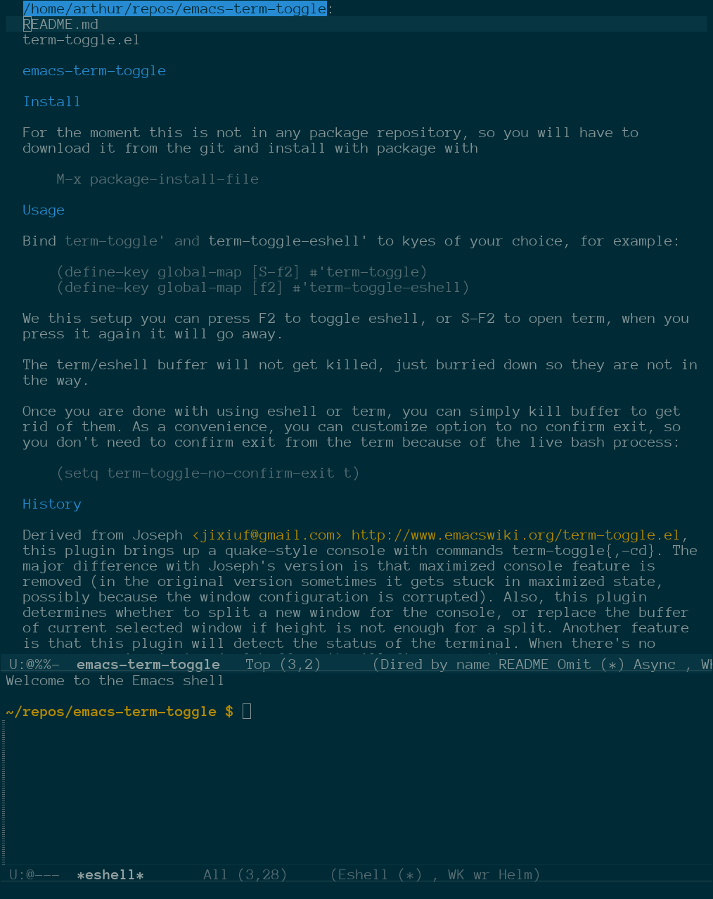

# emacs-term-toggle

## About

Term-toggle lets you toggle shells that come built-in with Emacs. Currently you can toggle shell, term, ansi-term, eshell, and ielm. You can put each one on a keyboard shortcut and toggle a console off and on as needed. The console will be
opened in the current buffer's default directory. This applicaiton is similar to [shell-pop](https://github.com/kyagi/shell-pop-el), but this one lets you have different terminals open at once, while shell-pop works only on pre-defined
one. I like to be able to work both with ielm/eshell and open a terminal from time to time, so I don't want to have just one pre-defined terminal I can pop back and forth.

## Install

For the moment this is not in any package repository, so you will have to download it from the git and install with package with

    M-x package-install-file

I will see if they would like to have it in Melpa.

Alternatively you may install it manually, if you don't know how to do it, please follow instructions as stated in the therm-toggle.el.

## Usage

Bind `term-toggle' and `term-toggle-eshell' to keys of your choice, for example:

    (define-key global-map [S-f2] #'term-toggle)
    (define-key global-map [f2] #'term-toggle-eshell)

We this setup you can press F2 to toggle eshell, or S-F2 to open term, when you press it again it will go away.

The term/eshell buffer will not get killed, just burried down so they are not in the way.

Once you are done with using eshell or term, you can simply kill buffer to get rid of them. As a convenience, you can customize option to no confirm exit, so you don't need to confirm exit from the term because of the live bash process:

    (setq term-toggle-no-confirm-exit t)

Optionally you can also customize option to kill-buffer and exit terminal window when shell process has exited:

    (setq term-toggle-kill-buffer-on-term-exit t)

This way, if you press Ctrl+D in you shell window, term buffer and window will be killed too.

## History

Derived from [Joseph's](https://www.emacswiki.org/emacs/term-toggle.el), this plugin brings up a quake-style console with commands term-toggle{,-cd}. The major difference with Joseph's version is that maximized console feature is removed
(in the original version sometimes it gets stuck in maximized state, possibly because the window configuration is corrupted). Also, this plugin determines whether to split a new window for the console, or replace the buffer of current
selected window if height is not enough for a split. Another feature is that this plugin will detect the status of the terminal. When there's no process running in *terminal* buffer, it will fire up another one.

Added to [Yatao's version](https://github.com/v-yadli/emacs-term-toggle) is ability to open eshell console in current buffers as well as the option `term-toggle-no-confirm-exit' to let Emacs exit term buffer and kill bash process without confirmation.

## Licence
  
This program is free software; you can redistribute it and/or modify it under the terms of the GNU General Public License as published by the Free Software Foundation, either version 3 of the License, or (at your option) any later version.

This program is distributed in the hope that it will be useful, but WITHOUT ANY WARRANTY; without even the implied warranty of MERCHANTABILITY or FITNESS FOR A PARTICULAR PURPOSE. See the GNU General Public License for more details.

You should have received a copy of the GNU General Public License along with this program. If not, see https://www.gnu.org/licenses/.

